# A propos

Le projet Portails Étudiant est une application web qui fournit une plateforme permettant aux étudiants, aux enseignants et aux administrateurs d'interagir entre eux. L'objectif principal de ce projet est de créer un hub central pour les étudiants, les enseignants et les administrateurs afin d'accéder aux informations sur l'université, leurs cours et leur progression académique.

-   Projet réalisé en 2022

# Video Demo :

# Captures D'ecran

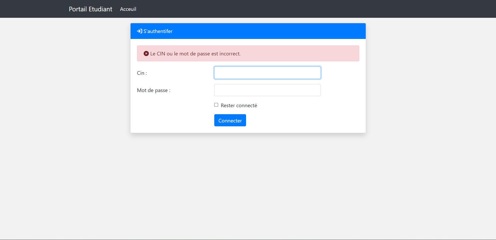
login

## Espace etudiant

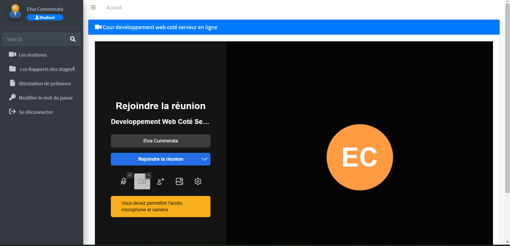
joindre un cours en ligne "Developpement web coté Serveur"

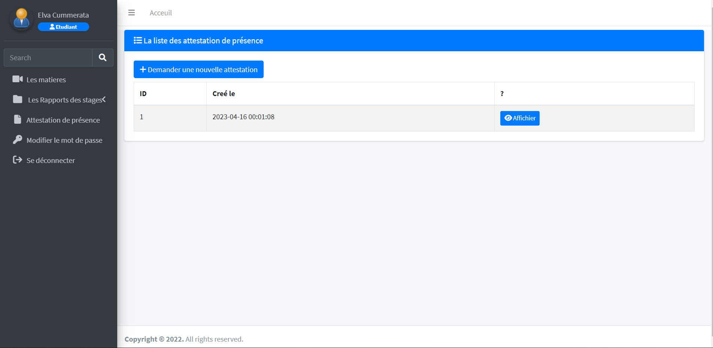
Demander une attestation de présence avec un QR code

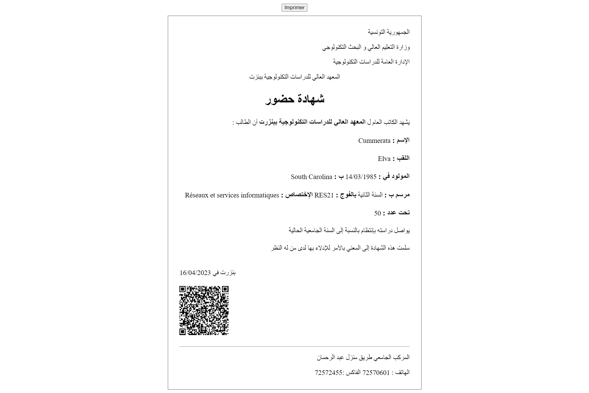
attestation de présence avec un QR code

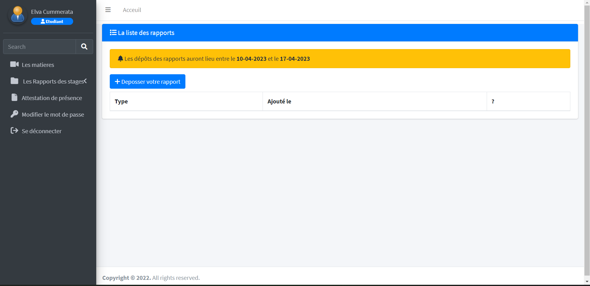
Déposer son rapport de stage (selon les dates fixées par l'administrateur)

## Admin:

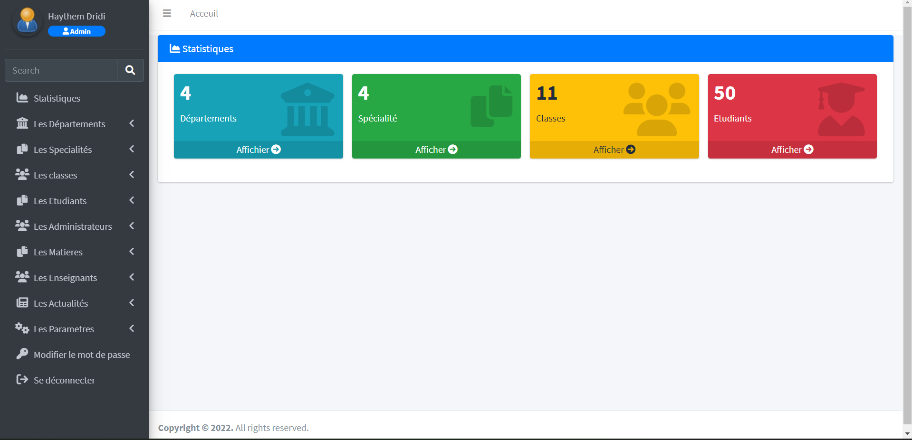
Statistiques

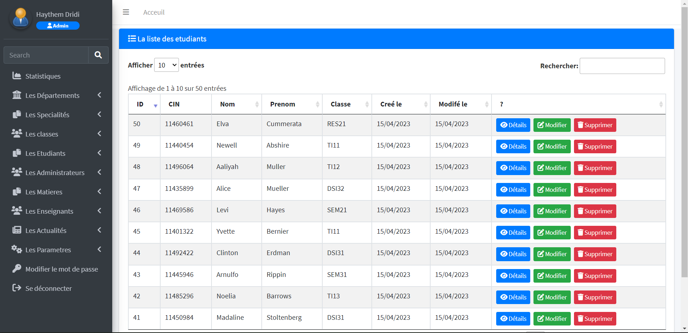
Gestion des etudiants

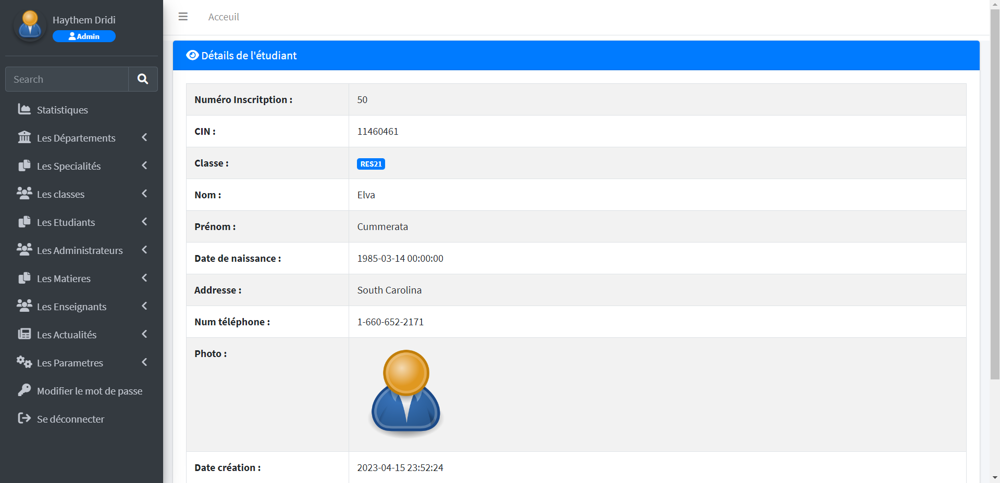
Gestion des etudiants

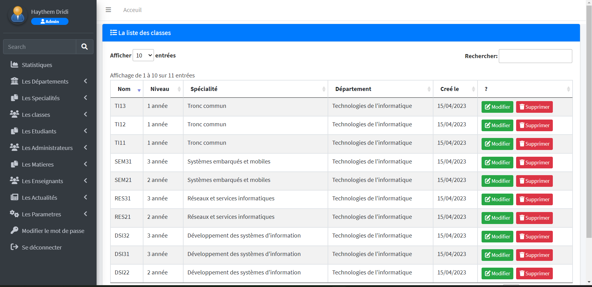
Gestion des classes

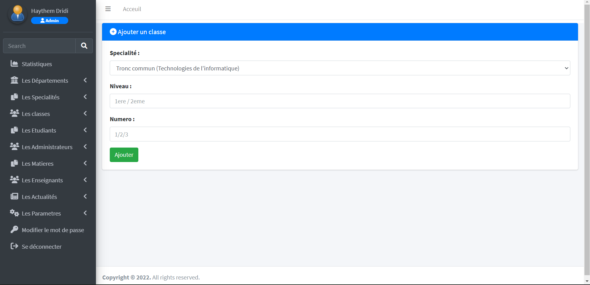
Gestion des etudiants

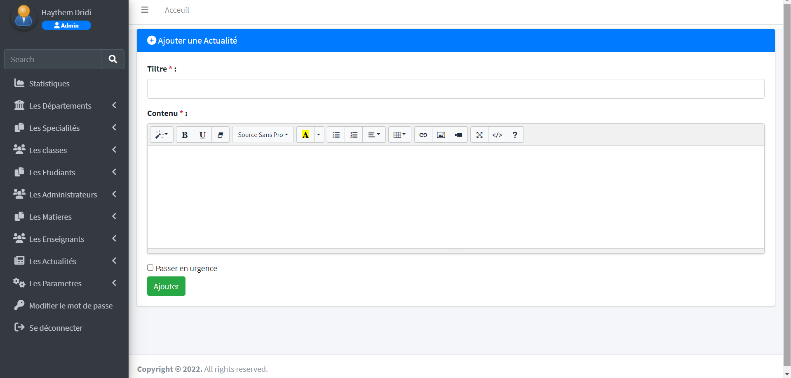
Ajouter une actualité (avec la possibilité d'envoyer une notification aux étudiants : push notification).

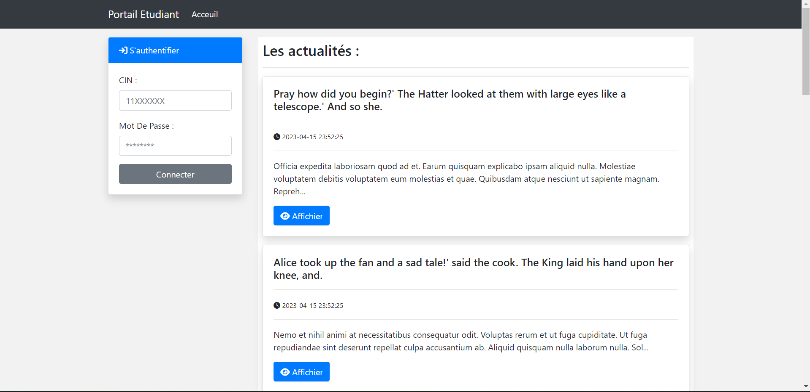
Modifier la date de dépôt des rapports

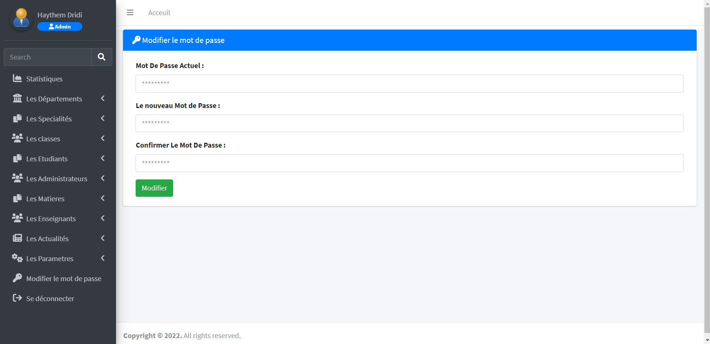
Modifier le mot de passe

Page d'accueil : liste des actualités

# Cas d'utilisations :

## Administrateur

-   Gestion des actualités
-   Statistiques
-   Gestion des départements
-   Gestion des spécialités
-   Gestion des classes
-   Gestion des étudiants
-   Gestion des administrateurs
-   Gestion des enseignants
-   Paramètres
-   Modifier son mot de passe

## Etudiant

-   Afficher les actualités
-   Liste de ses matières
-   Joindre un cours en ligne (Video)
-   Déposer son rapport de stage (selon les dates fixées par l'administrateur)
-   Demander une attestation de présence avec un QR code
-   Modifier son mot de passe

## Enseignant

-   Afficher les rapports de stage déposés par les étudiants.
-   Modifier son mot de passe
